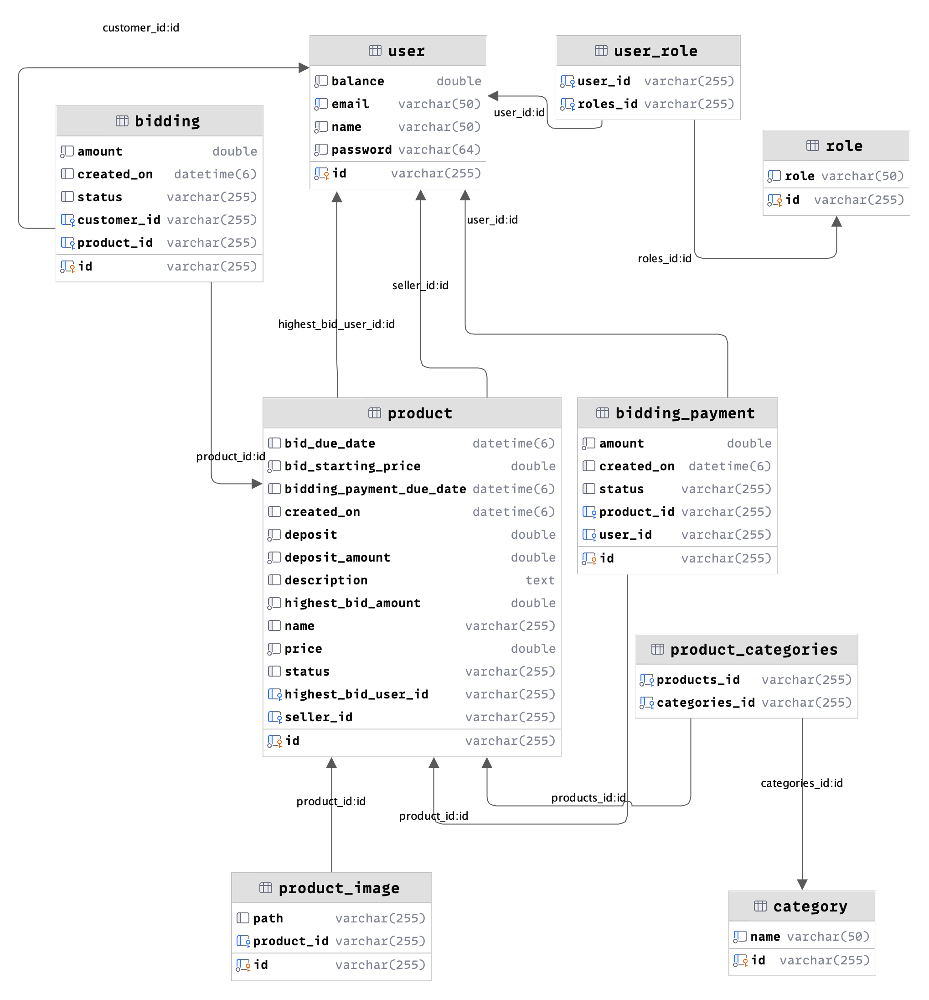
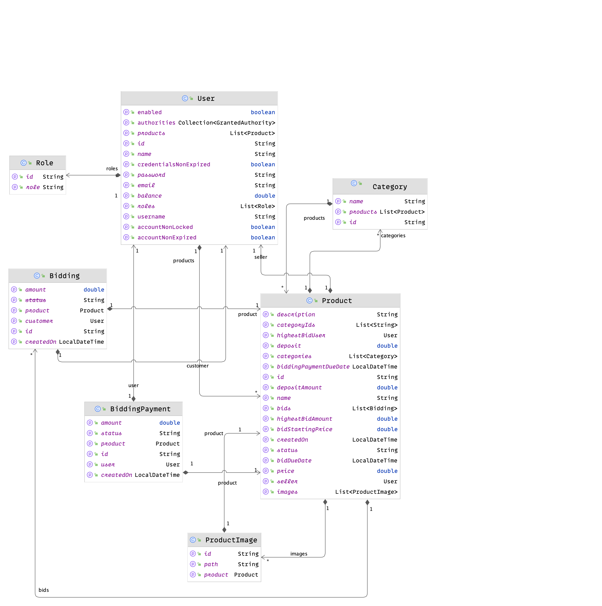

# Oktion

Oktion is a cutting-edge online auction platform designed to revolutionize the way individuals and businesses engage in
buying and selling goods and services. With a focus on security, transparency, and user-friendliness, Oktion provides a
seamless auction experience for both buyers and sellers, fostering trust and confidence in every transaction.

## ER Diagram



## Class Diagram



## Online Demo

Feel free to try it out. Check the credentials below.

### Account

[https://oktion.danielblandes.com](https://oktion.danielblandes.com)

- Seller
    - seller@oktion.app
    - sellerpassword

- Buyer John
    - john@oktion.app
    - johnpassword

- Buyer Jane
    - jane@oktion.app
    - janepassword

### App (Backend)

Swagger - [https://app.oktion.danielblandes.com/api/swagger-ui/index.html](https://app.oktion.danielblandes.com/api/swagger-ui/index.html)

# Key Features

- **Transparent Bidding Process**: Transparency is at the core of Oktion's ethos. Users can participate in auctions with
  full confidence, knowing that each bid is recorded and displayed in real-time. Additionally, Oktion incorporates
  features such as bid history tracking and detailed item descriptions to provide users with comprehensive information
  throughout the auction process.

- **User-Friendly Interface**: Oktion boasts an intuitive and user-friendly interface, making it easy for both novice
  and experienced users to navigate the platform with ease. From browsing available listings to placing bids and
  managing auctions, every aspect of Oktion is designed with the user's convenience in mind.

- **Customizable Auction Settings**: Whether hosting a small-scale auction for personal items or organizing a
  large-scale event for business purposes, Oktion offers customizable settings to suit a variety of auction needs. Users
  can set parameters such as auction duration and starting prices to tailor their auctions to their specific
  requirements.

- **Escrow Payment System**: Oktion integrates an escrow payment system to further enhance security and trust in
  transactions. When a bid is accepted, the winning bidder wallate is charged with the required amount to Oktion's
  escrow service.This safeguards both buyers and sellers against fraudulent activity and ensures that transactions are
  completed fairly and securely.

- **Advanced Security Measures**: Oktion employs state-of-the-art encryption and authentication protocols to ensure the
  highest level of security for users' data and transactions. From secure login procedures to encrypted data of Oktion
  prioritizes the protection of user information.

- **Development & Deployment**: Oktion adopts Docker containers to streamline development and deployment processes,
  enhancing the efficiency and consistency of its backend and frontend applications.

## Architecture

The application architecture is split in two different parts: app(backend) for API and account(frontend) for Sellers and
Bidding.

### App (Backend With Spring Framework)

Oktion's backend, developed using the [Spring Framework](https://spring.io/projects/spring-boot), stands out for its
robust performance and scalability.
Leveraging Spring Boot's capabilities, it incorporates an asynchronous
scheduler to efficiently manage tasks like
auction closing. Additionally, the integration of Swagger enhances the development process by providing thorough
documentation of the REST API, enabling seamless interaction and testing by developers.

- **RESTful API Development**: Oktion's backend employs RESTful APIs to facilitate communication between the server and
  client applications. These APIs handle various functionalities such as user authentication, auction management,
  bidding operations, and transaction processing.

- **Swagger Integration with Springdoc**:
  Oktion leverages [Springdoc](https://springdoc.org/), a library that seamlessly integrates Swagger with Spring-based
  applications. By annotating
  controllers and API endpoints, Oktion generates detailed API documentation automatically.

- **Data Management with Spring Data**: Spring Data is utilized for efficient data management, enabling seamless
  interaction with the underlying database. Oktion leverages Spring Data JPA to implement repository interfaces for
  performing CRUD (Create, Read, Update, Delete) operations on database entities.

- **Security Implementation**: Security is a top priority in Oktion's backend design. Spring Security is utilized to
  implement robust authentication and authorization mechanisms. This includes user authentication using JWT (JSON Web
  Tokens) for secure session management and role-based access control (RBAC) to enforce authorization policies.

- **Asynchronous Task Scheduling with Spring Scheduler**:
  Oktion utilizes Spring's built-in task scheduling capabilities, specifically the **@Scheduled** annotation, to define
  and execute asynchronous tasks at predetermined intervals or times. This allows the backend to handle time-sensitive
  operations, such as closing auctions, in a non-blocking manner.

### Account (React Framework)

The frontend of Oktion is built using the [React framework](https://legacy.reactjs.org/docs/getting-started.html), a
popular JavaScript library for building user interfaces.
React's component-based architecture and virtual DOM rendering make it ideal for creating dynamic and interactive web
applications.

- **Component-Based UI Development**: Oktion's frontend is structured around reusable React components, each responsible
  for rendering specific parts of the user interface. Components are modular and encapsulated, promoting code
  reusability
  and maintainability.

- **Responsive Design and UI/UX Optimization**: Oktion's frontend is developed with a focus on responsive design
  principles, ensuring a seamless user experience across devices of all sizes. CSS frameworks like Bootstrap or
  Material-UI may be utilized for efficient layout structuring and styling, enhancing the visual appeal and usability of
  the application.

## Requirements

- [Docker](https://docs.docker.com/install/)

## How to run it?

- Clone the repository

```bash
git clone git@gitlab.com:oktion/oktion.git
```

- Update env variables

```bash
cp .env.example .env
```

- Install dependencies

```bash
docker compose run app mvn clean install
```

- Run app

```bash
docker compose -f docker-compose.yml -f docker-compose.dev.yml up
```

## Where is the application running?

- Swagger - [http://localhost:8080/api/swagger-ui/index.html](http://localhost:8080/api/swagger-ui/index.html)
- PhpMyadmin - [http://localhost:8081](http://localhost:8081)
    - root
    - root

### What's next ?

Check the frontend on [Oktion Account](https://gitlab.com/oktion/oktion-account) repository